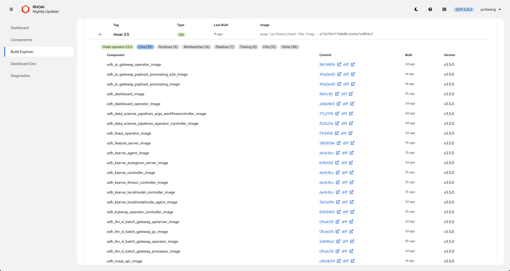

<p align="center">
  
</p>

<h1 align="center">RHOAI Nightly Updater</h1>

<p align="center">
  A web dashboard for managing Red Hat OpenShift AI nightly builds on ROSA HCP clusters.<br/>
  Install, upgrade, reinstall, and monitor RHOAI operators — no <code>oc</code> commands needed.
</p>

<p align="center">
  
</p>
<p align="center">
  
</p>

---

## Features

### Nightly Build Management
- **One-click update** with auto-fetch from Quay registry and FBC content preview
- **SSE streaming progress** — real-time step-by-step pipeline (8–13 steps depending on operation)
- **Reinstall** with full cleanup (webhooks, CRDs, stale component CRs) and channel override
- **Operator refresh** for same-version image updates without version change
- **Preflight checks** — pull secret, IDMS, operator health, registry access, node readiness
- **Downgrade prevention** — blocks update when selected version is older than current
- **Fresh cluster install** — automated setup from empty cluster to running operator
- **DSC creation** — one-click DataScienceCluster creation with default settings

### Cluster Visibility
- **DSC component status** — expandable breakdown (Ready / Needs Attention / Removed) with one-click fixes
- **Deployment table** — sortable, with pod-level ready count, rollout stuck detection, scheduling failure alerts
- **Git provenance** — commit SHA, diff link, and build date extracted from OCI image labels
- **Live diagnostics** — 9 automated health checks with doc-backed fix actions
- **Build Explorer** — browse all nightly tags, filter by version/type, preview FBC catalog contents inline

### Dashboard Dev (PR Testing)
- **Multi-container PR deploy** — scans 8 dashboard repos on Quay for matching PR images
- **One-click revert** to operator-managed images
- **Quick resource creator** — MinIO, per-project pipeline servers, MLflow CR lifecycle

### Platform
- **SSO authentication** via oauth-proxy with SAR gate (read-only mode for non-admins)
- **Confirmation modals** for all cluster-modifying actions
- **Activity audit log** stored in ConfigMap with user attribution
- **Dark mode**, structured JSON logging, Prometheus metrics + alerting rules
- **Production-ready** — pod anti-affinity, health probes, graceful shutdown

## Architecture

```
Browser --> oauth-proxy (OpenShift SSO) --> Go backend --> Kubernetes API
                                                 |
                                        React + PF6 static files
```

- **Frontend**: React 18, PatternFly 6, TypeScript, webpack
- **Backend**: Go (net/http), raw HTTP K8s client (no client-go), ServiceAccount token for k8s API calls
- **Auth**: oauth-proxy sidecar handles SSO, passes user identity via X-Forwarded-User
- **RBAC**: Scoped ClusterRole (not cluster-admin) limited to RHOAI resources
- **Security**: NetworkPolicy blocks direct access to backend port; only oauth-proxy port exposed

### Two-Phase Progress Model

Operator mutations use a two-phase progress model:

- **Phase A -- SSE Streaming**: The backend executes Kubernetes operations (apply CatalogSource, patch Subscription, delete CSV, etc.) and streams step-by-step progress events to the frontend over Server-Sent Events.
- **Phase B -- Status Polling**: After the SSE stream completes, the frontend switches to polling `/api/status` to track OLM reconciliation (InstallPlan approval, CSV phase transitions, deployment rollouts).

### Update Pipeline (8 steps)

1. **Prerequisites** -- verify pull secret and IDMS exist
2. **Snapshot** -- save current deployment state for change detection
3. **CatalogSource** -- apply/update the FBC catalog image
4. **READY wait** -- wait for the CatalogSource pod to become READY
5. **Channel detect** -- query PackageManifest for the correct nightly channel
6. **Subscription** -- apply Subscription pointing to the nightly catalog + detected channel
7. **Delete CSV** -- remove current ClusterServiceVersion to force a fresh InstallPlan
8. **Verify** -- confirm InstallPlan is created and OLM begins reconciliation

## Pages

### Components — Deployment Monitoring

Track every RHOAI deployment with per-container pod view, git commit provenance, and diff links.

<p align="center">
  
</p>

### Build Explorer — Nightly Build Browser

Browse all nightly tags, filter by version/type, and inspect FBC catalog contents with categorized component images.

<p align="center">
  
</p>
<p align="center">
  
</p>

| Page | Description |
|---|---|
| **Dashboard** | Operator status, prerequisites, upgrade/reinstall with pre-flight checks, reconciliation progress, activity log |
| **Components** | DSC v2 components, expandable deployments with per-container pod view, direct links to pod logs in OpenShift console |
| **Build Explorer** | Browse all FBC nightly tags, filter by version/type, search any image by digest, inspect categorized component images with git provenance |
| **Dashboard Dev** | Multi-container PR deploy (scans 8 repos), one-click revert, MinIO/pipeline/MLflow lifecycle |
| **Diagnostics** | 9 automated health checks, auto-detected problems with severity labels, one-click fixes |

## Quick Start

No build required — deploy the pre-built image with `oc process`. See the **[Quick Start Guide](docs/QUICKSTART.md)** for full step-by-step instructions covering:

- Fresh cluster setup (Steps 1–8)
- Existing cluster with RHOAI already installed
- Day-to-day usage workflows

---

## Development

```bash
./dev.sh    # starts Go backend + React dev server
```

See **[CONTRIBUTING.md](CONTRIBUTING.md)** for prerequisites, code patterns, testing, and build instructions. Run `make help` to see all available targets.

## Documentation

| Doc | Purpose |
|-----|---------|
| [QUICKSTART.md](docs/QUICKSTART.md) | Step-by-step deployment guide (fresh + existing clusters) |
| [CONTRIBUTING.md](CONTRIBUTING.md) | Local dev setup, code patterns, testing |
| [CLUSTER_CHANGES.md](docs/CLUSTER_CHANGES.md) | Every K8s resource the tool creates, modifies, or deletes |
| [RUNBOOK.md](RUNBOOK.md) | Operational troubleshooting procedures |
| [SECURITY.md](SECURITY.md) | Security model, auth, RBAC, input validation |
| [OPENSHIFT_INTEGRATION.md](docs/OPENSHIFT_INTEGRATION.md) | OpenShift-specific patterns and timing |

API endpoints are defined in `main.go`. Project structure follows standard Go layout — see `CONTRIBUTING.md` for details.

## License

Apache License 2.0
