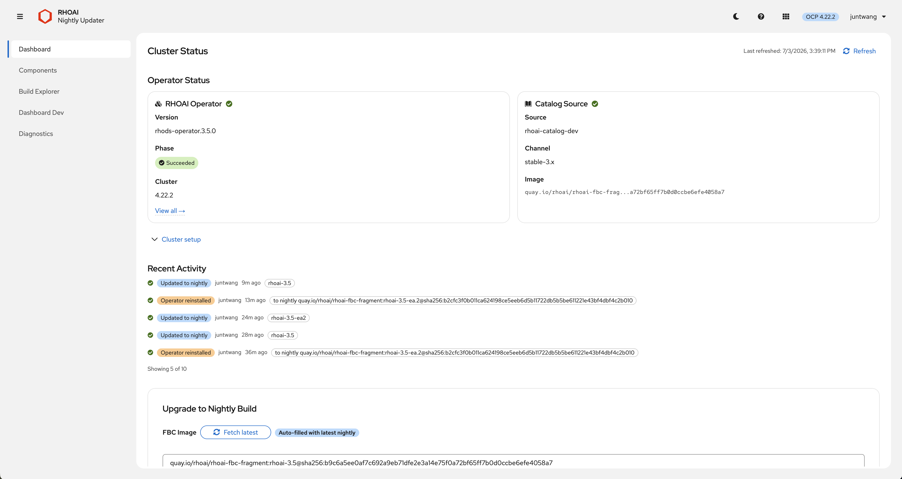
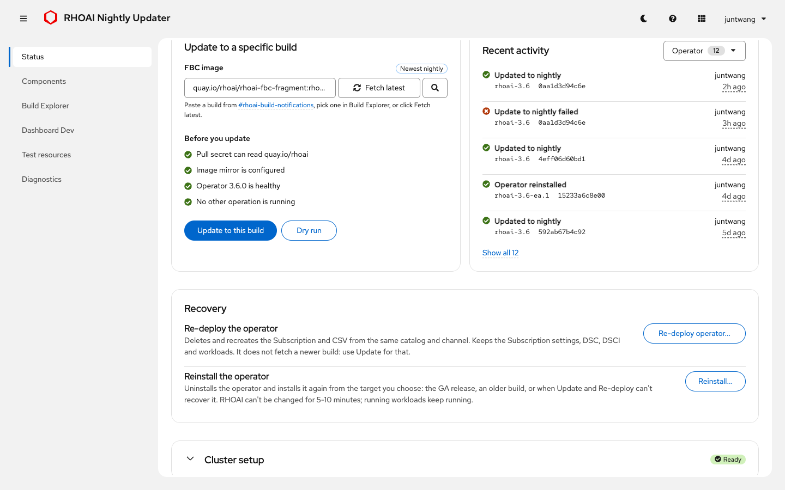
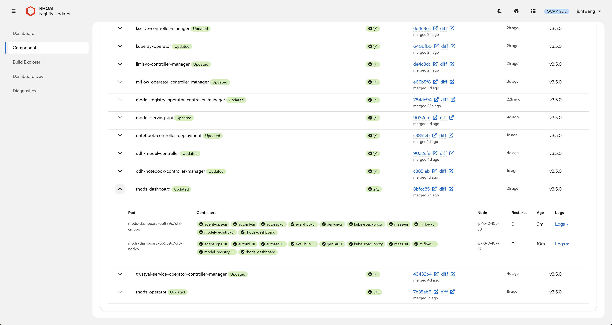
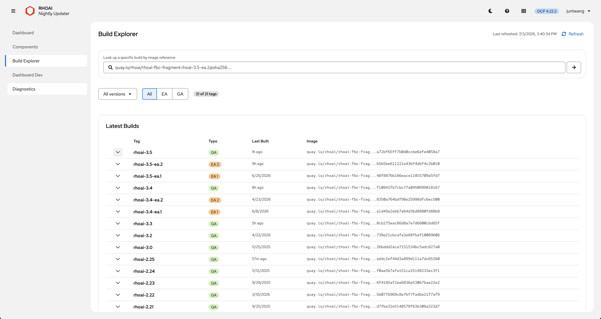

<p align="center">
  
</p>

<h1 align="center">RHOAI Nightly Updater</h1>

<p align="center">
  A web app for installing and updating Red Hat OpenShift AI nightly builds on your own ROSA HCP / OpenShift cluster,<br/>
  plus helpers for testing odh-dashboard builds. No <code>oc</code> commands needed day to day.
</p>

<p align="center">
  
</p>
<p align="center">
  
</p>

---

**New here? Start with the [Quick Start](docs/QUICKSTART.md).**

## Pages

| Page | What it does |
|---|---|
| **Status** | The installed build next to the latest nightly (Update available / Up to date), one-time cluster setup (pull secret, IDMS), **Update**, **Re-deploy the same version**, **Reinstall** (stable, a nightly, or an exact FBC image), live progress, and the activity log |
| **Components** | DSC components with fixes for invalid or extra fields. A no-DSC state offers **Preview and create**. The Deployments table lists problems first, with pod details, git provenance and console log links |
| **Build Explorer** | Every nightly tag: filter, inspect the FBC contents, compare with the installed build, search by image, commit SHA or PR |
| **Dashboard Dev** | Deploys an odh-dashboard PR or main to the installed dashboard (RHOAI Konflux builds `odh-pr-<N>`/`odh-stable`, or ODH OpenShift CI builds `pr-<N>`/`main`), then **Revert** |
| **Test resources** | MinIO, per-project pipeline servers, an MLflow instance and MLflow PR images |
| **Diagnostics** | Health checks with evidence and guidance. A few problems have an automatic fix, which asks for confirmation |

<p align="center">
  
</p>
<p align="center">
  
</p>

## How the tool keeps your cluster safe

The updater changes a shared, stateful system (OLM and the RHOAI operator). These rules are built in. [docs/CLUSTER_CHANGES.md](docs/CLUSTER_CHANGES.md) lists every object it touches.

**Who can change things.** Anyone who can sign in sees everything read-only. Changes need the **cluster-admin** role, checked with your own token on every request ([SECURITY.md](SECURITY.md)). Every change asks for confirmation and names what it will touch.

**One operation at a time.** A running operation shows a banner on every page, with who started it and the current step. Everyone sees it, and action buttons stay disabled until it finishes. A second request gets `409 cluster_busy` and changes nothing. Closing the tab doesn't stop an operation: after a reload, the page reattaches to the running operation. If the connection was lost, the result says "outcome unknown, see the activity log" unless the server reports the final outcome.

**Refuse before changing.** Update, Re-deploy and Reinstall run all their checks first (pull secret, IDMS, a test catalog for the exact image, version, OperatorGroup, a second rhods-operator Subscription). A refusal says "Nothing was changed".

**Dashboard Dev guard.** While a Dashboard Dev session pauses `dashboard-operator`, a banner says so on every page. Update, Re-deploy and Reinstall then refuse, and offer **Revert Dashboard Dev and continue**. A paused dashboard-operator would block RHOAI upgrades of the dashboard and hang any deletion of the Dashboard CR.

**Versions.**
- Update refuses an older build.
- Reinstall to an older version requires an explicit confirmation checkbox. OLM cannot downgrade: it replaces the CRDs that ship in the older bundle with their older versions, so newer-only fields can be pruned and a CRD the newer version no longer ships stays at the older schema after going back (Diagnostics flags it).
- Re-deploy never changes the version. With Automatic approval it refuses if the channel head has moved; with Manual approval it pins `startingCSV`.

**Manual approval is respected.** The Subscription's `installPlanApproval` and `spec.config` are kept. Under Manual approval, the tool approves only the InstallPlan it caused, and only if that plan installs exactly the confirmed rhods-operator CSV.

**Recovery on failure.** If the install fails, the previous catalog and Subscription are restored and the half-installed CSV is removed. A timeout while OLM is still installing keeps the new state. Every step is safe to re-run.

**Only the tool's own objects.** Objects the tool creates carry `app.kubernetes.io/managed-by=rhoai-nightly-updater`. Teardown deletes only labelled objects, with UID preconditions, so a look-alike someone else created is never removed. MinIO teardown keeps the `minio` namespace; delete it yourself with `oc delete project minio` once it's empty. Teardown is refused while a pipeline server still uses MinIO.

**Stale webhooks and finalizers.** A webhook configuration is removed only when all three of these hold:
- its Services are gone, or have had no ready endpoints for 5 minutes;
- its owning CSV or module is gone;
- no operator install is in progress.

Platform-owned configurations, and those whose owner is unknown, are never removed. A component CR's finalizer is removed only after 10 minutes of deletion, and only when its operator Deployment no longer exists.

**Diagnostics.** Most findings are guidance only: they explain the cause and the manual fix. The automatic fixes are:
- delete stale webhooks;
- delete Failed InstallPlans;
- assist a stuck rollout (`maxUnavailable: 1`, recorded and restorable);
- set one allowlisted optional component to Removed.

Each re-checks its precondition right before acting and reports "Nothing to do" when nothing needs changing.

**If the updater pod restarts mid-operation.** On SIGTERM the pod stops taking new changes (503, "restarting") and reports not ready. It then waits up to 980 s for the running operation: its 15-minute deadline plus a bounded restore and bookkeeping. `terminationGracePeriodSeconds` is 1020 and the strategy is `Recreate`, so rollouts never overlap. A deleted or evicted pod is replaced at once while it still drains, so every operation also holds a lease in the operation ConfigMap: the replacement shows the old pod's operation as running "on updater pod …" and refuses changes until it ends (a crashed pod's lease expires after 45 s). oauth-proxy exits immediately, so **the UI is offline for up to ~17 minutes** in that case. If the pod is killed anyway (SIGKILL, node loss), the next pod finds the operation marker and shows "*X* was interrupted" with what to do. Re-running the same operation is safe.

## Build Explorer PR search

Type `#123` or `PR 123` to see which nightlies contain a merged opendatahub-io/odh-dashboard PR. The tool checks up to 40 builds. A build "contains" the PR when its dashboard commit includes the PR's merge commit (GitHub compare in red-hat-data-services/odh-dashboard). **Limitation:** a PR that reached a release branch only as a cherry-pick has a different SHA, so it shows as *not contained*.

GitHub allows 60 unauthenticated requests per hour **per egress IP**, which every user of the pod shares. One uncached search costs about one call per build. Answers are cached, so repeats are free. Set a `GITHUB_TOKEN` (5000/hour); without it, once the limit is hit, commit dates stay blank and PR search reports the rate limit until GitHub's reset time.

## Configuration

Environment variables of the `app` container. The template sets the first group; leave those alone.

| Variable | Default | Purpose |
|---|---|---|
| `BIND_ADDRESS`, `PORT` | `127.0.0.1`, `8080` | API listener, reachable only by oauth-proxy |
| `METRICS_PORT` | `9090` | probes, `/api/version` and `/metrics` |
| `TEMPLATE_REVISION` | `2` | lets the UI warn admins when the Deployment is older than the image expects |
| `GITHUB_TOKEN` | unset | GitHub API token for commit dates and PR search. A read-only fine-grained token with public-repository read access is enough |
| `MINIO_IMAGE` | pinned `quay.io/hummingbird-community/minio@sha256:...` | must be a MinIO release ≥ 2022-10-29 that reads `MINIO_ROOT_USER/PASSWORD` and supports `--console-address` |
| `MINIO_ROOT_USER`, `MINIO_ROOT_PASSWORD` | random per install, kept in `minio/minio-secret` | MinIO credentials |
| `STABLE_SOURCE`, `STABLE_CHANNEL` | `redhat-operators`, detected | the catalog and channel used for "stable" |
| `DSC_SAMPLE_REF` | unset | take DSC defaults from this rhods-operator git ref instead of the installed CSV's `alm-examples` |
| `LOG_LEVEL` | `info` | `debug`, `warn`, `error` |
| `SHUTDOWN_DRAIN_TIMEOUT` | 980s | how long a terminating pod waits for a running operation; keep it below the grace period |

To set `GITHUB_TOKEN`, keep the token in a Secret. The Deployment restarts afterwards:

```bash
oc create secret generic github-token -n rhoai-nightly-updater --from-literal=GITHUB_TOKEN=<token>
oc set env deployment/rhoai-nightly-updater -n rhoai-nightly-updater -c app --from=secret/github-token
```

`make upgrade` keeps it: `oc apply` removes only fields that the previous apply set ([Kubernetes: declarative management](https://kubernetes.io/docs/tasks/manage-kubernetes-objects/declarative-config/)).

Local development variables (`DEV_MODE`, `DEV_TOKEN`, `KUBE_CA_FILE`, `DEV_INSECURE_TLS`, `DEV_ALLOW_REMOTE`, ...) are in [CONTRIBUTING.md](CONTRIBUTING.md#environment-variables).

## Architecture

```
Browser ──> Route (TLS reencrypt) ──> oauth-proxy :8443 ──> app 127.0.0.1:8080 ──> Kubernetes API (SA token)
                                                           app :9090  <── probes, Prometheus
```

- **Backend:** Go `net/http`, a raw-HTTP Kubernetes client (no client-go), JSON logs. API routes are in `pkg/api/routes.go`.
- **Frontend:** React 18, PatternFly 6, TypeScript, webpack; served by the backend.
- **Progress:** Update, Re-deploy and Reinstall stream their steps over SSE. Afterwards the page polls `/api/status`, and `GET /api/operation` shows the running operation to every viewer.
- **State:** ConfigMaps `rhoai-nightly-updater-activity` (audit log), `-snapshot` (pre-operation snapshot and the recorded Subscription), `-operation` (running-operation marker).

## Documentation

| Doc | For |
|---|---|
| [QUICKSTART.md](docs/QUICKSTART.md) | Deploying, first update, upgrading/rolling back the updater |
| [CLUSTER_CHANGES.md](docs/CLUSTER_CHANGES.md) | Every object the tool creates, patches or deletes, and when |
| [RUNBOOK.md](RUNBOOK.md) | Troubleshooting and manual recovery |
| [SECURITY.md](SECURITY.md) | Auth, RBAC, network exposure, residual risks |
| [CONTRIBUTING.md](CONTRIBUTING.md) | Local development, tests, CI |
| [OPENSHIFT_INTEGRATION.md](docs/OPENSHIFT_INTEGRATION.md) | OpenShift/OLM behaviour the code depends on |

## License

Apache License 2.0
