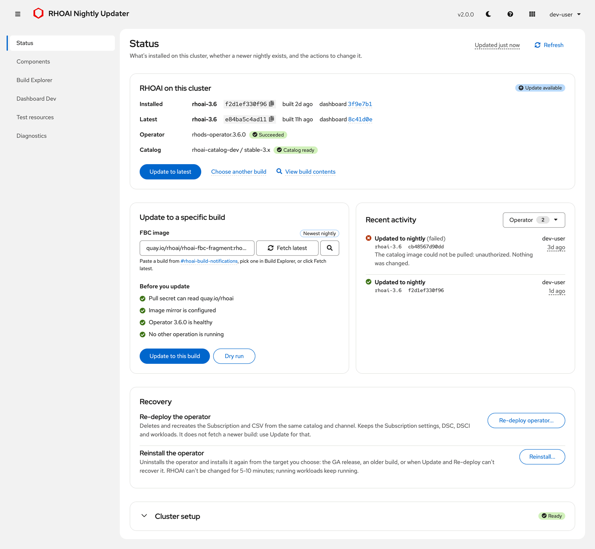
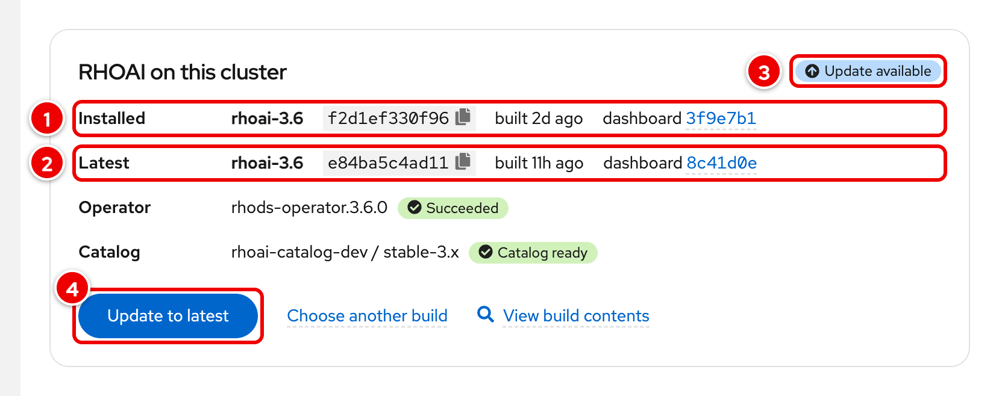
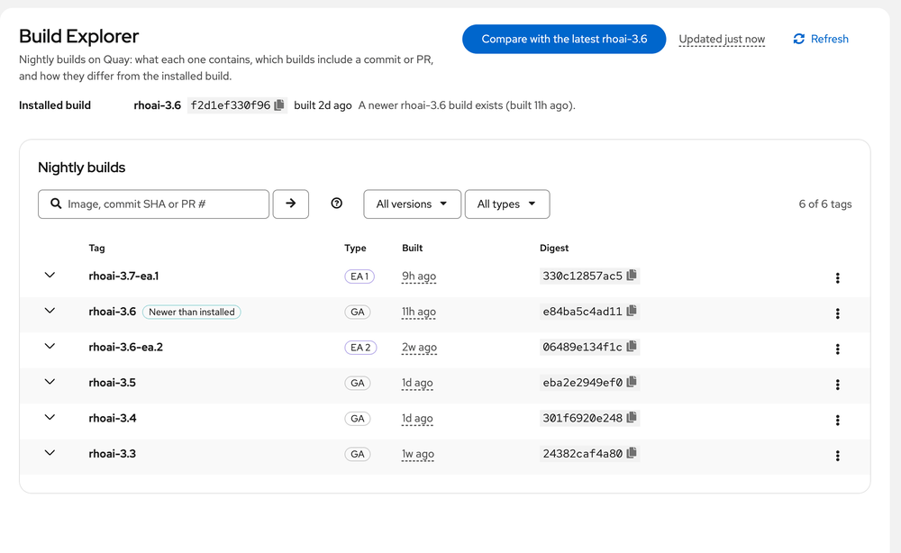
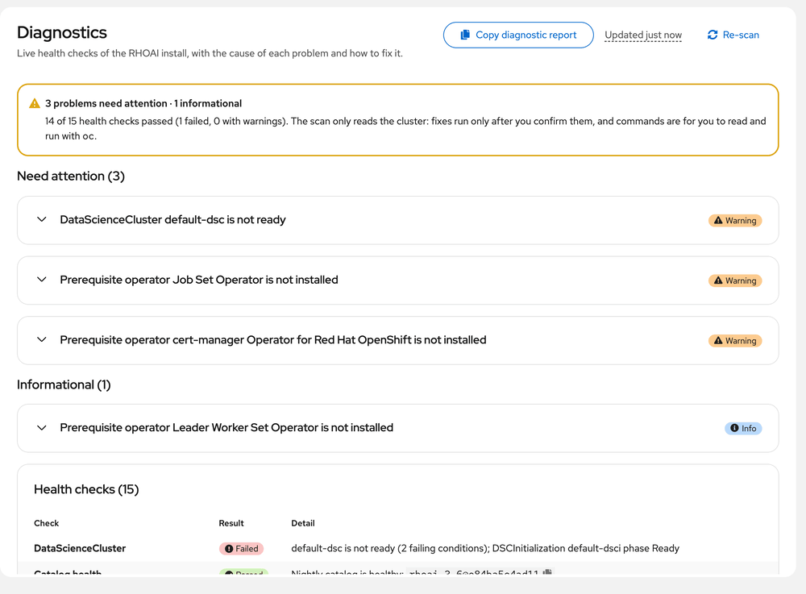
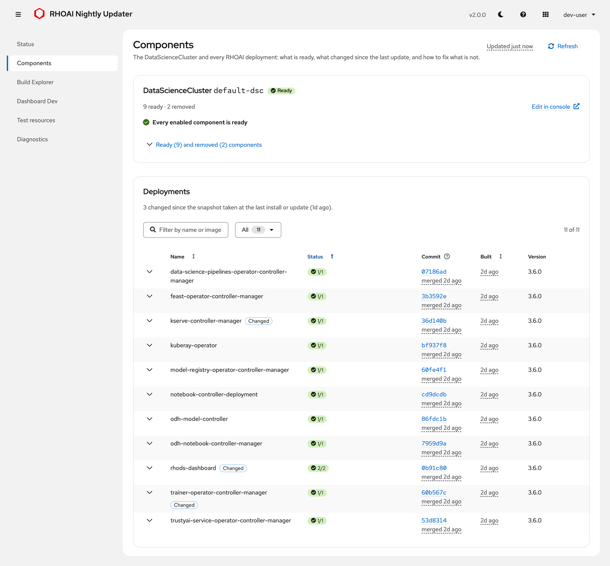
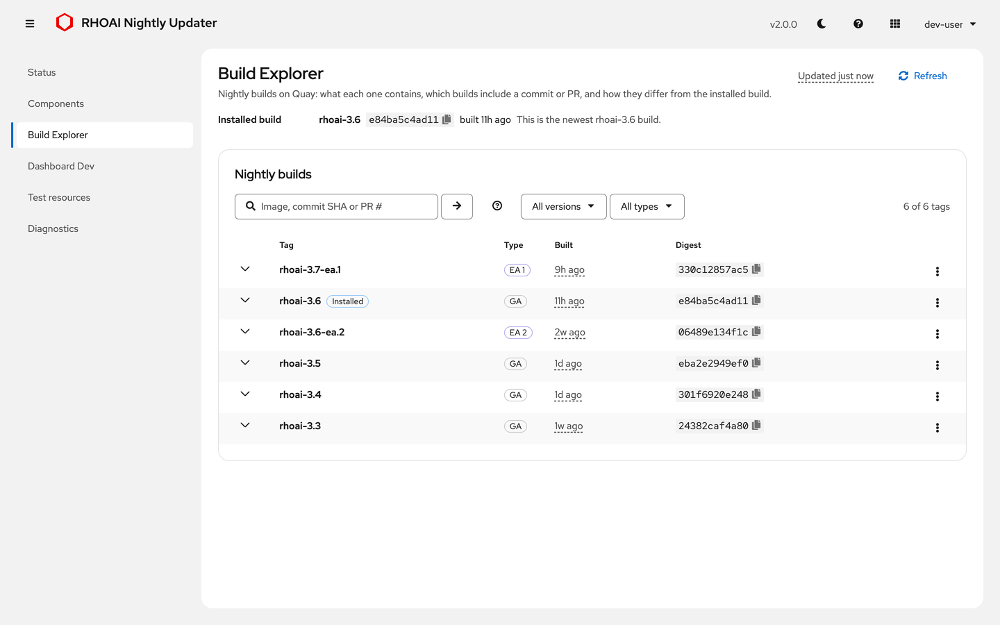
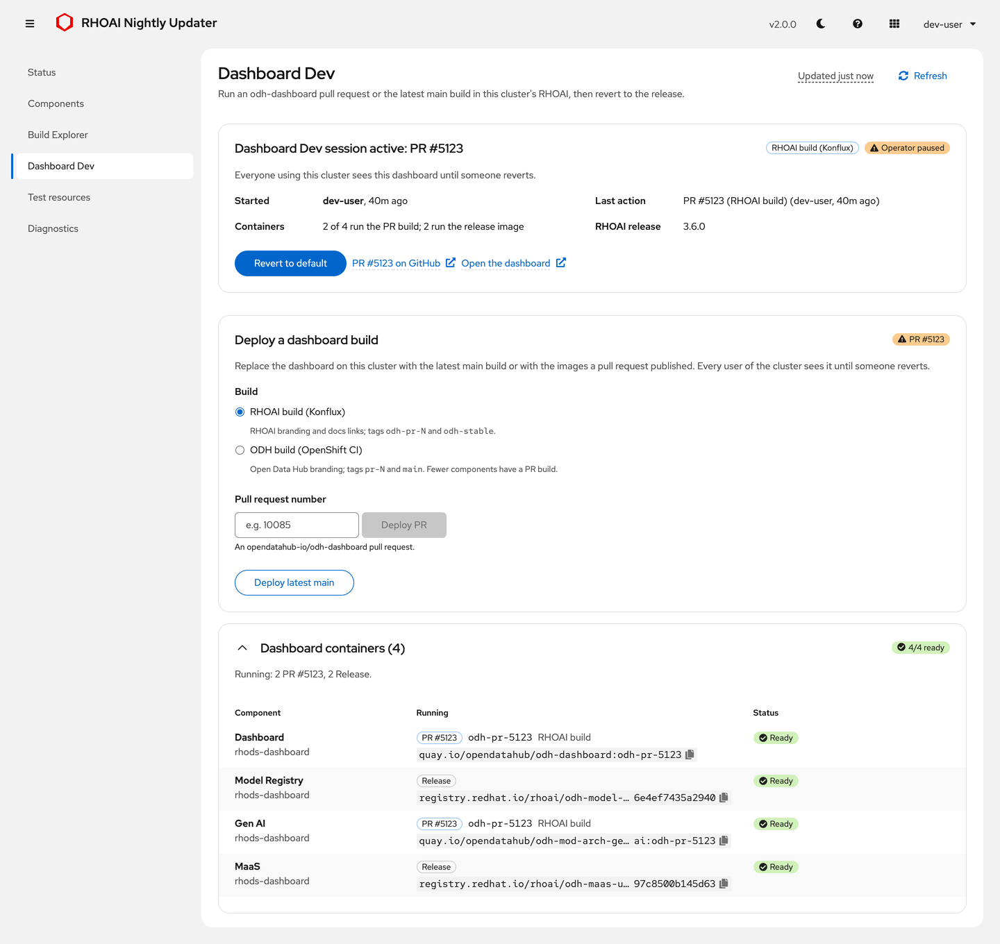
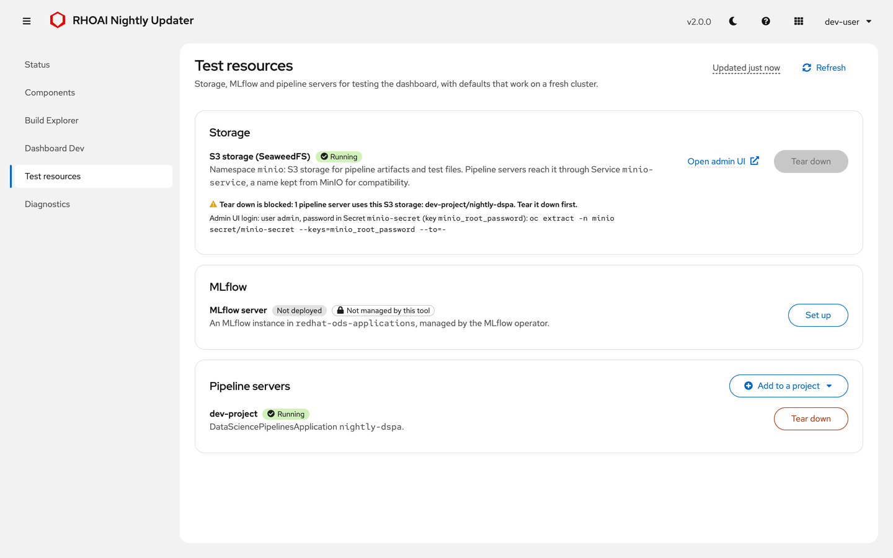
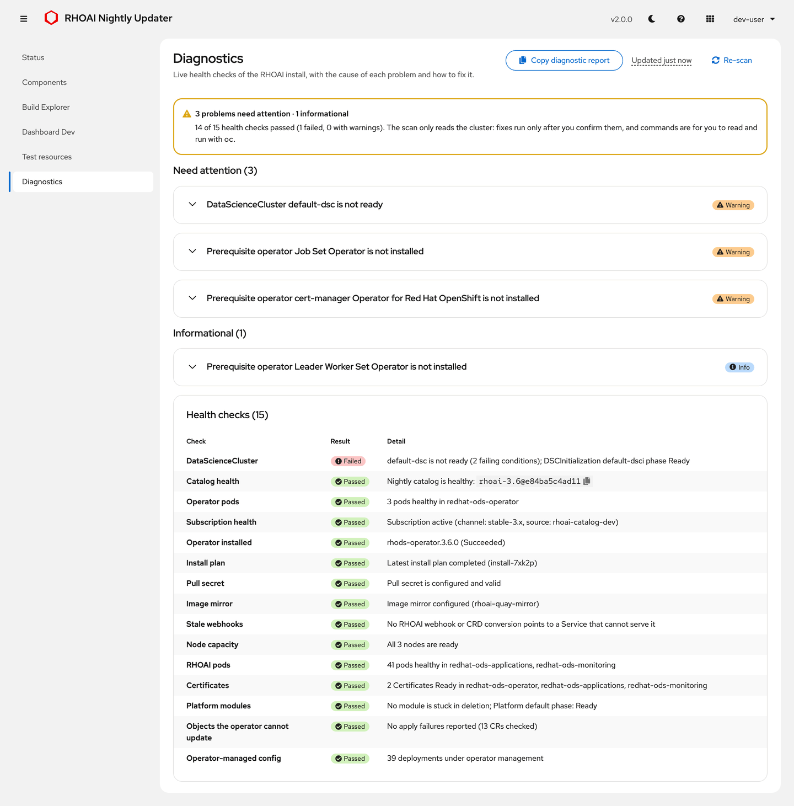
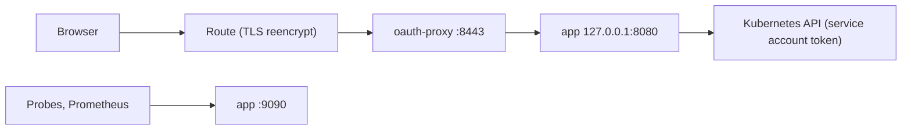

<p align="center">
  
</p>

<h1 align="center">RHOAI Nightly Updater</h1>

The RHOAI Nightly Updater is a web app that installs and updates Red Hat OpenShift AI (RHOAI) nightly builds on your own ROSA HCP or OpenShift cluster. It also deploys odh-dashboard pull requests, sets up test resources (S3 storage, pipeline servers, MLflow) and explains what is wrong when RHOAI is not healthy. You need no `oc` commands day to day: everything is a button, and every change asks for confirmation first.

<p align="center">
  <picture>
    <source media="(prefers-color-scheme: dark)" srcset="docs/images/page-status-dark.png">
    
  </picture>
</p>

## Install

Download the latest release's `install.sh`, read it, then run it. You need `oc` (logged in as cluster-admin) and `curl`:

```bash
curl -fsSLO https://github.com/DaoDaoNoCode/rhoai-nightly-updater/releases/latest/download/install.sh
less install.sh
bash install.sh --dry-run && bash install.sh
```

The installer prints the app URL when it is done. To check the download, compare `sha256sum install.sh` (macOS: `shasum -a 256 install.sh`) with the SHA-256 in the [release notes](https://github.com/DaoDaoNoCode/rhoai-nightly-updater/releases/latest). For a specific version, download `https://github.com/DaoDaoNoCode/rhoai-nightly-updater/releases/download/vX.Y.Z/install.sh` instead.

**New here? Follow the [Quick Start](docs/QUICKSTART.md)**: install, one-time setup and your first update, step by step. Installed before releases existed (your Deployment uses `:latest`)? Read [UPGRADING.md](docs/UPGRADING.md) first.

## A short tour

### Status: what is installed, and Update



1. **Installed**: the nightly build the cluster runs (tag, digest, build date, dashboard commit).
2. **Latest**: the newest build of the same stream on Quay.
3. The verdict: **Update available**, **Up to date**, **Operator failed** or **No Subscription**.
4. **Update to latest** installs the newest build. Progress streams step by step; if OLM fails, the previous catalog and Subscription are restored.

The same page has one-time cluster setup (pull secret, image mirror), **Update to a specific build**, **Recent activity** and **Recovery** (**Re-deploy operator...**, **Reinstall...**).

### Components: is RHOAI ready?


1. The DataScienceCluster state (**Ready** or **Not Ready**).
2. For each failing component, the operator's message and a short **Cause**, with a link to the fix on Diagnostics.

Below it, the Deployments table lists problems first, with pod details, git provenance and what changed since the last update.

### Build Explorer: which build has my change?



Every nightly tag on Quay: filter, see the contents of a build, compare it with the installed one, and search by image, commit SHA or PR number (`#5123`). See [PR search](#build-explorer-pr-search) for its limits.

### Dashboard Dev: try an odh-dashboard PR


1. Who deployed which build, and when. Everyone on the cluster sees this dashboard until someone reverts.
2. **Revert to default** restores the release images.

It deploys RHOAI Konflux builds (`odh-pr-<N>`, `odh-stable`) or ODH OpenShift CI builds (`pr-<N>`, `main`).

### Test resources: S3 storage, pipeline servers, MLflow


1. **S3 storage** is **Running**, on **SeaweedFS**, behind the `minio-service` name kept from MinIO.
2. **Open admin UI** opens the SeaweedFS admin UI (user `admin`).
3. **Tear down** stays disabled while a pipeline server uses the storage, and says which one.

Pipeline servers (one per project) and an MLflow instance are on the same page.

### Diagnostics: what is wrong, and how to fix it



Diagnostics scans on load and only reads the cluster. Each problem shows what was **Observed**, the **Fix**, and a **Command** you copy and run yourself. A few problems have a **Fix** button, which asks for confirmation first.

<details>
<summary><b>All pages, full size (light and dark)</b></summary>

| Page | Screenshot |
|---|---|
| Components | <picture><source media="(prefers-color-scheme: dark)" srcset="docs/images/page-components-dark.png"></picture> |
| Build Explorer | <picture><source media="(prefers-color-scheme: dark)" srcset="docs/images/page-build-explorer-dark.png"></picture> |
| Dashboard Dev | <picture><source media="(prefers-color-scheme: dark)" srcset="docs/images/page-dashboard-dev-dark.png"></picture> |
| Test resources | <picture><source media="(prefers-color-scheme: dark)" srcset="docs/images/page-test-resources-dark.png"></picture> |
| Diagnostics | <picture><source media="(prefers-color-scheme: dark)" srcset="docs/images/page-diagnostics-dark.png"></picture> |

The app follows your system theme; the moon icon in the masthead switches it. All screenshots come from a mock backend with made-up data (`make docs-screenshots`, see [docs/tools](docs/tools/README.md)).

</details>

## Documentation

| Doc | For |
|---|---|
| [QUICKSTART.md](docs/QUICKSTART.md) | Install, one-time setup, first update, test resources |
| [UPGRADING.md](docs/UPGRADING.md) | Which version you run, installs from before releases, moving between releases |
| [RUNBOOK.md](RUNBOOK.md) | Troubleshooting: what the app shows, and the fix |
| [CHANGELOG.md](CHANGELOG.md) | What each release changed, and its upgrade notes |
| [CLUSTER_CHANGES.md](docs/CLUSTER_CHANGES.md) | Every object the tool creates, patches or deletes, and when |
| [SECURITY.md](SECURITY.md) | Auth, RBAC, network exposure, residual risks |
| [CONTRIBUTING.md](CONTRIBUTING.md) | Local development, tests, CI, releases |
| [OPENSHIFT_INTEGRATION.md](docs/OPENSHIFT_INTEGRATION.md) | OpenShift and OLM behaviour the code depends on |

## Versions

Releases are `vMAJOR.MINOR.PATCH` ([CHANGELOG.md](CHANGELOG.md), [GitHub releases](https://github.com/DaoDaoNoCode/rhoai-nightly-updater/releases), [GitLab releases](https://gitlab.com/redhat/ai/rhoai-dashboard-team/rhoai-nightly-updater/-/releases)):

- **MAJOR**: the deployment template changed (`TEMPLATE_REVISION`, RBAC). Upgrade with that release's `install.sh` (or `git checkout vX.Y.Z && make upgrade`), which re-applies the template; a new image alone would not work.
- **MINOR**: features. **PATCH**: fixes. Same template.

Each release attaches `install.sh` (its template embedded; it installs exactly that release, pinned by digest) and `deploy/template.yaml`. Image tags: `:vX.Y.Z` (immutable), `:vN` (newest release of major N), `:latest` (newest release of the major line it is on; it never moves to a new major by itself), `:main` and `:<8-char commit>` (test builds of `main`). The app shows the running release in the masthead and a notice when a newer one exists ([UPGRADING §1](docs/UPGRADING.md#1-which-version-am-i-running)).

## How the tool keeps your cluster safe

The updater changes a shared, stateful system (OLM and the RHOAI operator). These rules are built in. [docs/CLUSTER_CHANGES.md](docs/CLUSTER_CHANGES.md) lists every object it touches.

**Who can change things.** Anyone who can sign in sees everything read-only. Changes need the **cluster-admin** role, checked with your own token on every request ([SECURITY.md](SECURITY.md)). Every change asks for confirmation and names what it will touch.

**One operation at a time.** A running operation shows a banner on every page, with who started it and the current step. Everyone sees it, and action buttons stay disabled until it finishes. A second request gets `409 cluster_busy` and changes nothing. Closing the tab doesn't stop an operation: after a reload, the page reattaches to the running operation. If the connection was lost, the result says "outcome unknown, see the activity log" unless the server reports the final outcome.

**Refuse before changing.** Update, Re-deploy and Reinstall run all their checks first (pull secret, IDMS, a test catalog for the exact image, version, OperatorGroup, a second rhods-operator Subscription). A refusal says "Nothing was changed".

**Dashboard Dev guard.** While a Dashboard Dev session pauses `dashboard-operator`, a banner says so on every page. Update, Re-deploy and Reinstall then refuse, and offer **Revert Dashboard Dev and continue**. A paused dashboard-operator would block RHOAI upgrades of the dashboard and hang any deletion of the Dashboard CR.

**Versions.**
- Update refuses an older build.
- Reinstall to an older version requires an explicit confirmation checkbox. OLM cannot downgrade: it replaces the CRDs that ship in the older bundle with their older versions, so newer-only fields can be pruned and a CRD the newer version no longer ships stays at the older schema after going back (Diagnostics flags it).
- Re-deploy never changes the version. With Automatic approval it refuses if the channel head has moved; with Manual approval it pins `startingCSV`.

**Manual approval is respected.** The Subscription's `installPlanApproval` and `spec.config` are kept. Under Manual approval, the tool approves only the InstallPlan it caused, and only if that plan installs exactly the confirmed rhods-operator CSV.

**Recovery on failure.** If the install fails, the previous catalog and Subscription are restored and the half-installed CSV is removed. A timeout while OLM is still installing keeps the new state. Every step is safe to re-run.

**Only the tool's own objects.** Objects the tool creates carry `app.kubernetes.io/managed-by=rhoai-nightly-updater`. Teardown deletes only labelled objects, with UID preconditions, so a look-alike someone else created is never removed. S3 storage teardown keeps the `minio` namespace; delete it yourself with `oc delete project minio` once it's empty. Teardown is refused while a pipeline server still uses the storage.

**Stale webhooks and finalizers.** A webhook configuration is removed only when all three of these hold:
- its Services are gone, or have had no ready endpoints for 5 minutes;
- its owning CSV or module is gone;
- no operator install is in progress.

Platform-owned configurations, and those whose owner is unknown, are never removed. A component CR's finalizer is removed only after 10 minutes of deletion, and only when its operator Deployment no longer exists.

**Diagnostics.** Most findings are guidance only: they explain the cause and the manual fix. The automatic fixes are:
- delete stale webhooks;
- delete Failed InstallPlans;
- assist a stuck rollout (`maxUnavailable: 1`, recorded and restorable);
- set one allowlisted optional component to Removed;
- restart a module operator that has not retried (a rolling restart).

Each re-checks its precondition right before acting and reports "Nothing to do" when nothing needs changing.

**If the updater pod restarts mid-operation.** On SIGTERM the pod stops taking new changes (503, "restarting") and reports not ready. It then waits up to 980 s for the running operation: its 15-minute deadline plus a bounded restore and bookkeeping. `terminationGracePeriodSeconds` is 1020 and the strategy is `Recreate`, so rollouts never overlap. A deleted or evicted pod is replaced at once while it still drains, so every operation also holds a lease in the operation ConfigMap: the replacement shows the old pod's operation as running "on updater pod ..." and refuses changes until it ends (a crashed pod's lease expires after 45 s). oauth-proxy exits immediately, so **the UI is offline for up to ~17 minutes** in that case. If the pod is killed anyway (SIGKILL, node loss), the next pod finds the operation marker and shows "*X* was interrupted" with what to do. Re-running the same operation is safe. Diagrams: [RUNBOOK §5](RUNBOOK.md#5-operations-busy-stuck-interrupted).

## Build Explorer PR search

Type `#123` or `PR 123` to see which nightlies contain a merged opendatahub-io/odh-dashboard PR. The tool checks up to 40 builds. A build "contains" the PR when its dashboard commit includes the PR's merge commit (GitHub compare in red-hat-data-services/odh-dashboard). **Limitation:** a PR that reached a release branch only as a cherry-pick has a different SHA, so it shows as *not contained*.

GitHub allows 60 unauthenticated requests per hour **per egress IP**, which every user of the pod shares. One uncached search costs about one call per build. Answers are cached, so repeats are free. Set a `GITHUB_TOKEN` (5000/hour); without it, once the limit is hit, commit dates stay blank and PR search reports the rate limit until GitHub's reset time.

## Configuration

Environment variables of the `app` container. The template sets the first group; leave those alone.

| Variable | Default | Purpose |
|---|---|---|
| `BIND_ADDRESS`, `PORT` | `127.0.0.1`, `8080` | API listener, reachable only by oauth-proxy |
| `METRICS_PORT` | `9090` | probes, `/api/version` and `/metrics` |
| `TEMPLATE_REVISION` | `4` | lets the UI warn admins when the Deployment is older than the image expects |
| `IMAGE_REPOSITORY`, `RELEASES_URL` | the Quay repository, the GitLab releases page | the update check: the highest `vX.Y.Z` tag of the repository, and where its release notes are; an empty `IMAGE_REPOSITORY` turns it off |
| `GITHUB_TOKEN` | unset | GitHub API token for commit dates and PR search. A read-only fine-grained token with public-repository read access is enough |
| `SEAWEEDFS_IMAGE` | pinned `ghcr.io/chrislusf/seaweedfs@sha256:...` (4.48) | the S3 storage image, for example a mirror; must be a SeaweedFS 4.x whose `weed mini` reads `WEED_ADMIN_*`. `MINIO_IMAGE` is no longer read |
| `MINIO_ROOT_USER`, `MINIO_ROOT_PASSWORD` | random per install, kept in `minio/minio-secret` | S3 access key and secret key (the secret key is also the admin UI password); the names are kept from MinIO |
| `STABLE_SOURCE`, `STABLE_CHANNEL` | `redhat-operators`, detected | the catalog and channel used for "stable" |
| `DSC_SAMPLE_REF` | unset | take DSC defaults from this rhods-operator git ref instead of the installed CSV's `alm-examples` |
| `LOG_LEVEL` | `info` | `debug`, `warn`, `error` |
| `SHUTDOWN_DRAIN_TIMEOUT` | 980s | how long a terminating pod waits for a running operation; keep it below the grace period |

To set `GITHUB_TOKEN`, keep the token in a Secret. The Deployment restarts afterwards:

```bash
oc create secret generic github-token -n rhoai-nightly-updater --from-literal=GITHUB_TOKEN=<token>
oc set env deployment/rhoai-nightly-updater -n rhoai-nightly-updater -c app --from=secret/github-token
```

Upgrades (`install.sh`, `make upgrade`) keep it: `oc apply` removes only fields that the previous apply set ([Kubernetes: declarative management](https://kubernetes.io/docs/tasks/manage-kubernetes-objects/declarative-config/)).

Local development variables (`DEV_MODE`, `DEV_TOKEN`, `KUBE_CA_FILE`, `DEV_INSECURE_TLS`, `DEV_ALLOW_REMOTE`, ...) are in [CONTRIBUTING.md](CONTRIBUTING.md#environment-variables).

## Architecture



- **Backend:** Go `net/http`, a raw-HTTP Kubernetes client (no client-go), JSON logs. API routes are in `pkg/api/routes.go`.
- **Frontend:** React 18, PatternFly 6, TypeScript, webpack; served by the backend.
- **Progress:** Update, Re-deploy and Reinstall stream their steps over SSE. Afterwards the page polls `/api/status`, and `GET /api/operation` shows the running operation to every viewer.
- **State:** ConfigMaps `rhoai-nightly-updater-activity` (audit log), `-snapshot` (pre-operation snapshot and the recorded Subscription), `-operation` (running-operation marker, last result and the cross-pod lease).

## License

Apache License 2.0
