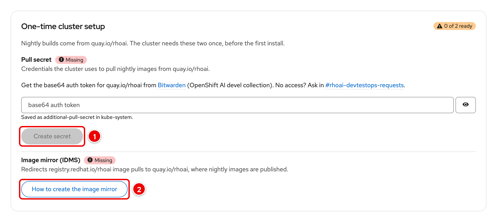
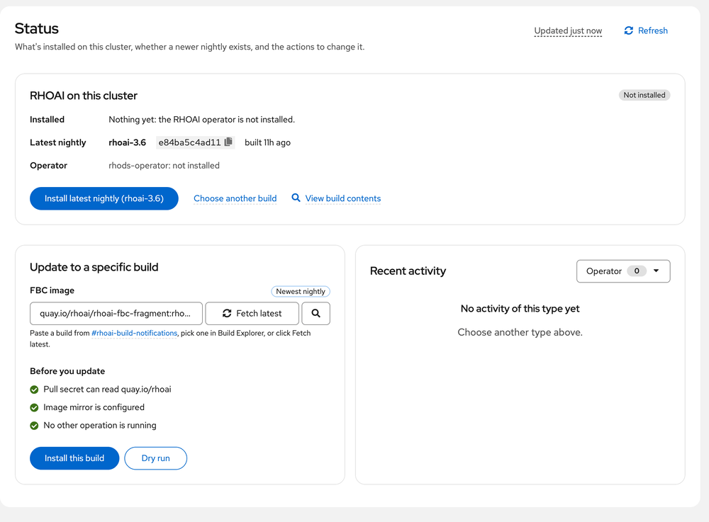
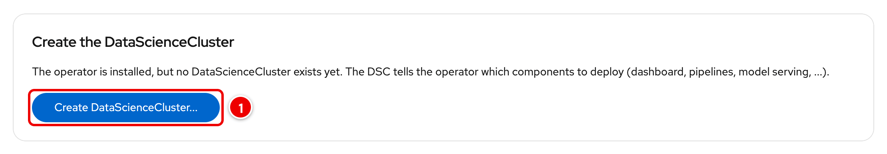
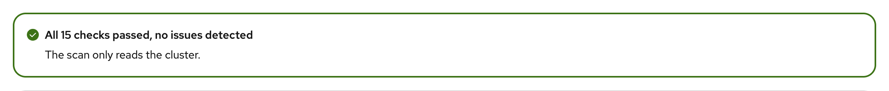
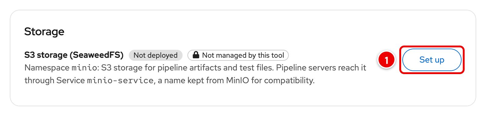
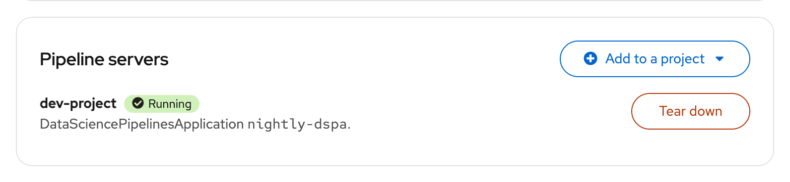

# Quick Start

From an empty ROSA HCP (or OpenShift) cluster to a running RHOAI nightly in about 15 minutes. After step 1, everything happens in the app.

Before your first change, read **[How the tool keeps your cluster safe](../README.md#how-the-tool-keeps-your-cluster-safe)**.

| Step | You do | Time |
|---|---|---|
| [0](#0-before-you-start) | Check the prerequisites | 2 min |
| [1](#1-install-the-updater) | Install the updater with the release's `install.sh` | 3 min |
| [2](#2-open-the-app) | Open the app | 1 min |
| [3](#3-one-time-setup-pull-secret-and-image-mirror) | One-time setup: pull secret and image mirror | 5 min |
| [4](#4-install-rhoai) | Install the latest RHOAI nightly | 5–8 min |
| [5](#5-create-the-datasciencecluster) | Create the DataScienceCluster | 1 min |
| [6](#6-check-that-rhoai-is-healthy) | Check that RHOAI is healthy | 2 min |
| [7](#7-test-resources-s3-storage-and-a-pipeline-server) | Optional: S3 storage and a pipeline server | 3 min |

## 0. Before you start

- A ROSA HCP or OpenShift cluster, **OCP 4.15 or newer**. The `ose-oauth-proxy-rhel9` image has no v4.14 tag.
- **cluster-admin** on that cluster. You need it to install the updater, and the app allows changes only to cluster-admins (everyone else is read-only). On ROSA, the cluster owner can grant it to a user of the cluster's identity provider:
  ```bash
  rosa grant user cluster-admin --user=<username> --cluster=<cluster-name>
  ```
  For a quick break-glass login, `rosa create admin --cluster=<cluster-name>` creates a `cluster-admin` user and prints an `oc login` command. Syntax checked with `rosa` 1.2.57 (`rosa grant user --help`, `rosa create admin --help`).
- `oc`, logged in (`oc whoami` shows your cluster-admin user), and `curl`. `git` and `make` only for the clone path.
- A Quay.io pull token for `quay.io/rhoai`. Get it from [Bitwarden](https://vault.bitwarden.com/#/vault?collectionId=75f54536-fa36-4ef9-8f1a-b09701646cac&itemId=e6e1fdde-6601-4e8b-8154-b211005518a1) (Openshift AI devel collection). No access? Ask in [#rhoai-devtestops-requests](https://redhat.enterprise.slack.com/archives/C07TF3MBMMW).

## 1. Install the updater

Pick the newest release on [GitHub](https://github.com/DaoDaoNoCode/rhoai-nightly-updater/releases) or [GitLab](https://gitlab.com/redhat/ai/rhoai-dashboard-team/rhoai-nightly-updater/-/releases). Download its `install.sh` (it contains that release's `deploy/template.yaml`), check it against the SHA-256 in the release notes, and read it:

```bash
curl -fsSLO https://github.com/DaoDaoNoCode/rhoai-nightly-updater/releases/download/vX.Y.Z/install.sh
echo "<SHA-256 from the release notes>  install.sh" | sha256sum -c -   # macOS: shasum -a 256 -c
less install.sh
```

Then run it:

```bash
bash install.sh --dry-run   # optional: resolve, check and validate with the API server only
bash install.sh             # namespace rhoai-nightly-updater; --namespace / --app-name to change
```

`install.sh`:
- checks that you are logged in as cluster-admin;
- resolves `quay.io/juntao_wang/rhoai-nightly-updater:vX.Y.Z` to its digest and checks that the image was built from the release's commit;
- creates the namespace and the oauth-proxy cookie Secret;
- applies the template, with the oauth-proxy tag that matches your cluster's OCP version;
- waits for the rollout, then adds the app to the console's application menu.

**What you should see:** the last line is `App URL: https://...`. `bash install.sh --help` lists the options.

<details>
<summary>From a clone instead (contributors; also needed for <code>make rollback</code> and the smoke test)</summary>

```bash
git clone https://gitlab.com/redhat/ai/rhoai-dashboard-team/rhoai-nightly-updater.git
cd rhoai-nightly-updater
git checkout vX.Y.Z         # make deploy installs the release HEAD is on
make deploy                 # DRY_RUN=1 only validates
```

`make deploy` runs the same `scripts/install.sh`, with the template of your checkout. Optional, from a checkout of the same release: `./scripts/smoke-test.sh rhoai-nightly-updater rhoai-nightly-updater` runs read-only checks of the live install.

</details>

If it stops with an `ERROR:` line:
- *"HEAD is not on a release tag"*: check out a release (`git checkout vX.Y.Z`), or pass `TAG=main` / `TAG=<commit>` to test a build.
- *"deploy/template.yaml in this checkout differs"*: your checkout is not the release you install. *"uncommitted changes"* means you edited the template locally.
- *"cannot resolve ... to a digest"*: the tag doesn't exist, or quay.io is unreachable.
- More in [UPGRADING.md](UPGRADING.md#6-faq).

## 2. Open the app

Open the printed URL, or use the grid icon in the OpenShift console (Red Hat Applications → RHOAI Nightly Updater). Sign in with OpenShift. To find the URL again:

```bash
oc get route rhoai-nightly-updater -n rhoai-nightly-updater -o jsonpath='https://{.spec.host}{"\n"}'
```


**What you should see:** the **Status** page. The masthead shows (1) the release you installed, for example `v2.0.0`, then the theme switch, **Help** (`?`), the application menu and your user name. A fresh cluster shows **One-time cluster setup** first.

## 3. One-time setup: pull secret and image mirror

Nightly builds come from `quay.io/rhoai`. The cluster needs a pull secret for it and an image mirror, once.



1. **Pull secret:** paste the `quay.io/rhoai` token (step 0) and click **Create secret**. The tool stores it in `kube-system/additional-pull-secret` and replaces only the `quay.io/rhoai` entry.
2. **Image mirror (IDMS):** click **How to create the image mirror** for the instructions. RHOAI images reference `registry.redhat.io/rhoai`; the mirror redirects them to `quay.io/rhoai`.

On ROSA HCP the mirror is created through OCM. You need the Red Hat VPN and ROSA CLI access (separate from `oc`):

```bash
kinit <your-username>@IPA.REDHAT.COM
rh-aws-saml-login                # select iaps-rhods-odh-dev
rosa login --use-auth-code
rosa whoami

rosa create image-mirror --cluster=<cluster-name> \
  --source=registry.redhat.io/rhoai \
  --mirrors=quay.io/rhoai
```

(Syntax checked with `rosa create image-mirror --help`, rosa 1.2.57. `digest` is the default and only type.) A 403 means you lack OCM write access to the cluster; ask its owner.

On self-managed OpenShift instead:

```bash
oc apply -f - <<'EOF'
apiVersion: config.openshift.io/v1
kind: ImageDigestMirrorSet
metadata:
  name: rhoai-quay-mirror
spec:
  imageDigestMirrors:
    - source: registry.redhat.io/rhoai
      mirrors:
        - quay.io/rhoai
EOF
```

**What you should see:** both items stop saying **Missing**. Once both are done, the setup card moves to the bottom of the page, collapsed, as **Cluster setup** with a green **Ready** label, and **Install latest nightly** is enabled. Allow 2–3 minutes for the nodes to pick up the credentials and the mirror.

## 4. Install RHOAI

On the **Status** page, the **RHOAI on this cluster** card shows the newest nightly. Click **Install latest nightly**, read the confirmation, and click **Install**:



To install another build, use **Choose another build**, or paste an image from [#rhoai-build-notifications](https://redhat.enterprise.slack.com/archives/C07ANR2U56C) under **Update to a specific build**. **Dry run** checks a build and changes nothing.

**What you should see:** eight steps, from **Check prerequisites** to **Wait for the operator install**, each with a green check. OLM gets up to 8 minutes to install the operator. You can leave the page: the operation keeps running, and every page shows a banner until it ends. Then **Update complete** appears, the card says **Up to date**, and a **Create the DataScienceCluster** card appears.

If a step fails, the card says which one and why. A failed install restores the previous state; see [RUNBOOK §6](../RUNBOOK.md#6-update--reinstall-failed).

## 5. Create the DataScienceCluster



1. Click **Create DataScienceCluster...**. The dialog shows the YAML of `default-dsc`, with the defaults of the installed operator. Click **Create**.

**What you should see:** a success message. The operator now deploys the components (dashboard, pipelines, model serving, ...); this takes a few minutes. You can change components later on the **Components** page.

## 6. Check that RHOAI is healthy

Open **Components**, then **Diagnostics**.



**What you should see:**
- **Components:** DataScienceCluster `default-dsc` is **Ready** and every enabled component is ready. Right after step 5, some deployments are still rolling out; refresh after a few minutes.
- **Diagnostics:** **All 15 checks passed, no issues detected**. If a problem is listed, open it: it shows what was observed and the fix. [RUNBOOK §11.7](../RUNBOOK.md#117-datasciencecluster-not-ready) explains each one.

## 7. Test resources: S3 storage and a pipeline server

Optional, for testing pipelines in the dashboard. Open **Test resources**.



1. Under **Storage**, click **Set up** and confirm. The tool deploys SeaweedFS in namespace `minio`, with a bucket `pipelines`, behind Service `minio-service`.



2. Under **Pipeline servers**, open **Add to a project**, pick a data science project and confirm. The pipeline server uses the S3 storage.

**What you should see:** **S3 storage** shows **Running** and **SeaweedFS**, with **Open admin UI** (user `admin`; the password is in Secret `minio-secret` in `minio`). The pipeline server shows **Running** after 1–3 minutes. Tear down the pipeline servers before the storage: **Tear down** of the storage stays disabled while one uses it.

## Day to day

| Task | Where |
|---|---|
| Update to a new nightly | Status → **Update to latest**, or **Update to a specific build** ([what it looks like](images/update.gif)) |
| Re-deploy the installed version (same version, fresh pods) | Status → Recovery → **Re-deploy operator...** |
| Switch to stable, another nightly, or an exact older build | Status → Recovery → **Reinstall...** (downgrades need a confirmation checkbox) |
| Test an odh-dashboard PR or main | Dashboard Dev → choose the RHOAI (Konflux) or ODH (OpenShift CI) build → **Deploy PR** or **Deploy latest main**; **Revert to default** when done |
| S3 storage (SeaweedFS), pipeline servers, MLflow | Test resources |
| Which nightly contains PR #N? | Build Explorer → search `#123` ([PR search](../README.md#build-explorer-pr-search)) |
| Something looks wrong | Diagnostics → open the problem; automatic fixes ask for confirmation. [RUNBOOK](../RUNBOOK.md) |

## Upgrade, roll back or remove the updater

- **Upgrade:** when the app says "vX.Y.Z is available", download that release's `install.sh` (step 1) and run it; it sees the existing install and upgrades it, keeping everyone signed in. From a clone: `git fetch --tags && git checkout vX.Y.Z && make upgrade`. Details, and installs from before releases: [UPGRADING.md](UPGRADING.md).
- **Roll back:** from a clone, `git fetch --tags && make rollback TAG=v1.0.0` (`DRY_RUN=1` validates). It applies that release's own template with its image and keeps sessions. `oc rollout undo` does not work, because old ReplicaSets are pruned on purpose. [UPGRADING §5](UPGRADING.md#5-roll-back).
- If a cluster operation is running, an upgrade or rollback waits for it: the updater (UI included) is offline for up to ~17 minutes.
- **Remove:** `bash install.sh uninstall` (or `make undeploy` from a clone) removes the updater, its cluster-wide RBAC and its ConsoleLink. It does **not** remove RHOAI, the nightly catalog, the pull secret, the IDMS, or anything created from Test resources. Tear those down in the app first.

## Notes

- Metrics and alerts work only with user workload monitoring enabled (OpenShift docs: "Enabling monitoring for user-defined projects"). It is off by default; see [RUNBOOK §7](../RUNBOOK.md#7-metrics-and-alerts).
- Build Explorer PR search works better with a `GITHUB_TOKEN` (see [README: Configuration](../README.md#configuration)).
- Problems: [RUNBOOK.md](../RUNBOOK.md). Everything the tool changes: [CLUSTER_CHANGES.md](CLUSTER_CHANGES.md).
