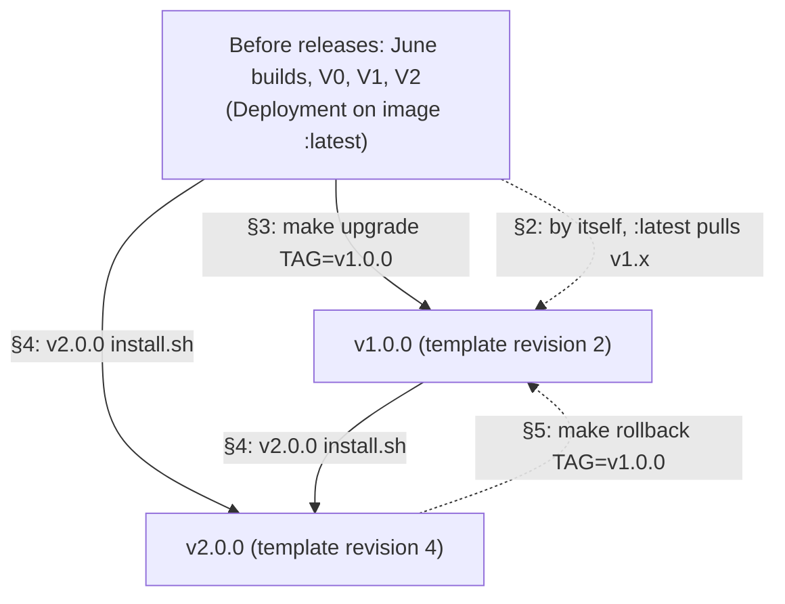
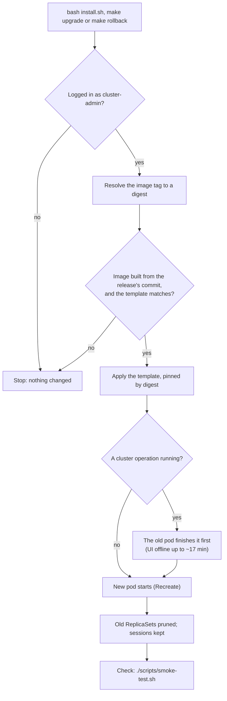
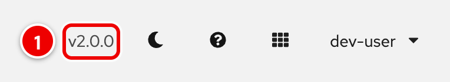
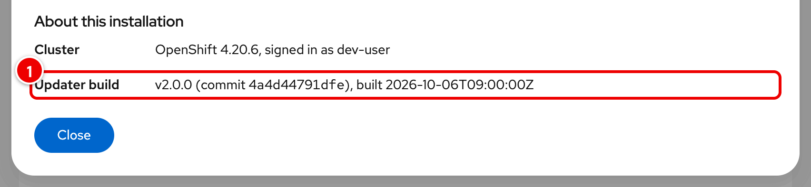
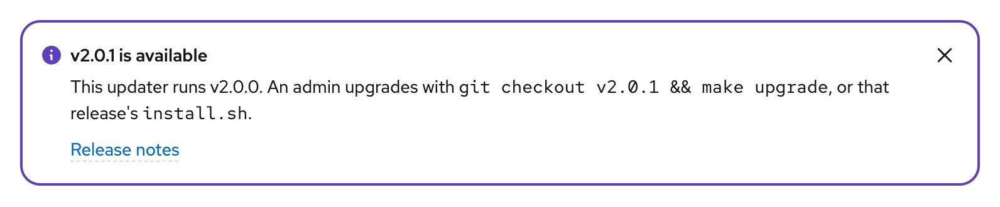

# Upgrading the RHOAI Nightly Updater

For anyone who installed the updater before releases existed (before
2026-10-06), or who wants to move between releases. Versions follow
`vMAJOR.MINOR.PATCH`; a new MAJOR means the deployment template changed and
needs a full redeploy ([CHANGELOG.md](../CHANGELOG.md)).

Releases: [GitHub](https://github.com/DaoDaoNoCode/rhoai-nightly-updater/releases)
and [GitLab](https://gitlab.com/redhat/ai/rhoai-dashboard-team/rhoai-nightly-updater/-/releases)
(the GitLab project may ask you to sign in). Each release has an `install.sh`
with that release's template inside; it needs only `oc`, logged in as
cluster-admin, and `curl`.

The commands below use the default names; set yours first:

```bash
NS=rhoai-nightly-updater APP=rhoai-nightly-updater
```

## Upgrade paths at a glance



Solid arrows are upgrades you run (sections 3 and 4). The dashed arrows are
a rollback (section 5) and what an install on `:latest` does by itself
(section 2). Every upgrade re-applies the release's own template; a new major
version never works with only a new image.

How an upgrade or a rollback runs:



## 1. Which version am I running?

### In the app



1. The masthead shows the running release, for example `v2.0.0`. Builds of
   `main` or of a commit show no version here.



1. **Help** (`?`) → **About this installation** → **Updater build**: the
   release, its commit and its build date.

When a newer release exists, every page shows a notice. A new MAJOR version
says it **requires a full redeploy**:


A MINOR or PATCH release needs only that release's `install.sh` (or
`make upgrade` from its checkout):



If the Deployment was created from an older template than the running image
expects (typically an install on `:latest` that pulled a newer image), every
page shows this notice for admins. Upgrade as in sections 3 and 4:


Dismissing the release notice hides it until an even newer release.

### From the command line

```bash
# The image reference of each container: a tag (:latest), a digest (@sha256:...) or a release (:vX.Y.Z)
oc get deploy $APP -n $NS -o jsonpath='{range .spec.template.spec.containers[*]}{.name}={.image}{"\n"}{end}'
# Shape of the Deployment and the template revision (empty before v1.0.0)
oc get deploy $APP -n $NS -o jsonpath='replicas={.spec.replicas} strategy={.spec.strategy.type} grace={.spec.template.spec.terminationGracePeriodSeconds} revision={.spec.template.spec.containers[?(@.name=="app")].env[?(@.name=="TEMPLATE_REVISION")].value}{"\n"}'
# The Route timeout (180s or 960s before v1.0.0)
oc get route $APP -n $NS -o jsonpath='{.metadata.annotations.haproxy\.router\.openshift\.io/timeout}{"\n"}'
# The digest the running pod actually runs
oc get pods -n $NS -l app=$APP -o jsonpath='{range .items[*]}{.metadata.name} {.status.containerStatuses[?(@.name=="app")].imageID}{"\n"}{end}'
```

To see which build a digest is, read its labels (the `version` label is the
release, or the 8-character commit for builds from before releases):

```bash
oc image info quay.io/juntao_wang/rhoai-nightly-updater@sha256:<digest> --filter-by-os=linux/amd64 | grep -E 'version=|revision='
```

The running app also reports it: the masthead shows a release (for example
`v2.0.0`), and the help dialog (`?`) shows the build. From the command line:
`oc exec -n $NS deploy/$APP -c app -- curl -s http://127.0.0.1:9090/api/version`
(builds from before v1.0.0 answer on port 8080, if at all).

| Install | How to recognise it |
|---|---|
| June 25 – July 1 builds | 7-character image tags; the image labels are the UBI base's (`version` 9.6), with no app commit. Template unknown, most likely V0 |
| V0 (template 5051672, July 2) | `replicas=2`, `RollingUpdate`, image `:latest`, no `TEMPLATE_REVISION`, Route timeout 180s, `COOKIE_SECRET` as a plain env value, ClusterRole/ClusterRoleBinding/ConsoleLink named `<APP_NAME>` |
| V1 (template 68f6f58, July 3 – Sept 29) | as V0 but `replicas=1` |
| V2 (template b394d00, Sept 30 – Oct 5) | as V1 but Route timeout 960s |
| v1.0.0 | image `@sha256:...`, `Recreate`, grace 1020, `TEMPLATE_REVISION=2`, cookie secret in Secret `<APP_NAME>-proxy`, RBAC named `<APP_NAME>-<NAMESPACE>` |
| v2.0.0 | as v1.0.0 with `TEMPLATE_REVISION=4`; the masthead shows `v2.0.0` |

The template changes of October 3–5 were never published before v1.0.0, so no
install runs them.

## 2. "My Deployment references `:latest`. Am I at risk?"

V0, V1 and V2 installs (and the June builds) reference `:latest` by tag, and a
`:latest` tag pulls on every pod start. Any rollout (a node drain, a cluster
upgrade, an eviction) then runs whatever `:latest` is.

`:latest` is now the newest release **of major version 1** and never moves to
a new major version by itself, so these installs get v1.0.0 (or a later
v1.x) and keep working: every page loads, and the "this updater's deployment
is out of date" notice asks an admin to upgrade. Verified on 2026-10-06 for
V0, V1 and V2.

Still, upgrade deliberately (sections 3–4): until then the image can change
under you. To freeze the install first, pin the Deployment to the digest it
runs now:

```bash
oc set image deployment/$APP -n $NS app="$(oc get pods -n $NS -l app=$APP -o jsonpath='{.items[0].status.containerStatuses[?(@.name=="app")].imageID}')"
```

## 3. Upgrade to v1.0.0

v1.0.0 has no `install.sh` (it predates the installer), so this needs a clone:

```bash
git clone https://gitlab.com/redhat/ai/rhoai-dashboard-team/rhoai-nightly-updater.git
cd rhoai-nightly-updater
git fetch --tags && git checkout v1.0.0
make upgrade NAMESPACE=$NS APP_NAME=$APP TAG=v1.0.0    # DRY_RUN=1 validates only
./scripts/smoke-test.sh $NS $APP
```

What it changes: the image is pinned by digest; `Recreate` with a 1020-second
grace period (one replica, so a V0 install goes from 2 replicas to 1); the
cookie secret moves from the env value to Secret `<APP_NAME>-proxy`, so
sessions survive; RBAC is renamed to `<APP_NAME>-<NAMESPACE>` and narrowed;
the legacy ClusterRole, ClusterRoleBinding and ConsoleLink named `<APP_NAME>`
are deleted; old ReplicaSets are pruned. Verified on 2026-10-06 for V0, V1
and V2: the smoke test passes.

## 4. Upgrade to v2.0.0

From v1.0.0, or directly from V0, V1, V2 or a June build. Without a clone:

```bash
curl -fsSLO https://github.com/DaoDaoNoCode/rhoai-nightly-updater/releases/download/v2.0.0/install.sh
less install.sh                                     # read it first
bash install.sh --dry-run --namespace $NS --app-name $APP
bash install.sh --namespace $NS --app-name $APP
```

Check the download first: `sha256sum install.sh` (macOS: `shasum -a 256 install.sh`) must match the SHA-256 in the release notes.

**Verified live on 2026-10-06**, with a v2.0.0 `install.sh` generated from the release branch:

| Path | Result |
|---|---|
| Fresh install | Installed and running |
| V0 → v2.0.0 (directly) | 2 replicas → 1; `Recreate`; template revision 4; no literal `COOKIE_SECRET` (it moved to Secret `<APP_NAME>-proxy`); the legacy ClusterRole, ClusterRoleBinding and ConsoleLink replaced by the namespaced ones; smoke test passed |
| V1 → v2.0.0, V2 → v2.0.0 (directly) | The same as V0, without the replica change; smoke test passed |
| v1.0.0 → v2.0.0 | Upgraded; smoke test passed |
| `make rollback TAG=v1.0.0` from v2.0.0 | Rolled back with the image pinned by digest; the v2 smoke test passed against the running image's expected template revision 2 |
| v1.0.0 → v2.0.0 again, with the installer | Upgraded |
| `bash install.sh uninstall` | Removed everything; no cluster-scoped objects left |

v2.0.0 was not published yet, so the installer in these tests pointed at an
image in the cluster's own registry instead of `quay.io`. The final check
with the published `install.sh` happens at release.

From a clone: `git fetch --tags && git checkout v2.0.0 && make upgrade NAMESPACE=$NS APP_NAME=$APP`.
Then check with `./scripts/smoke-test.sh $NS $APP` from a v2.0.0 checkout.

`install.sh` does everything `make upgrade` does (section 3), so the same
steps apply to legacy installs. It installs exactly v2.0.0: it resolves
`:v2.0.0` to a digest and refuses an image that was not built from the
release's commit.

What v2.0.0 changes on top of v1.0.0:
- template revision 4 and new RBAC (prerequisite operands, cert-manager
  Certificates, the SeaweedFS objects);
- the S3 test storage moves from MinIO to SeaweedFS on the next storage setup
  or repair. SeaweedFS starts empty; the old `minio-pvc` is kept until
  teardown ([RUNBOOK §10.1](../RUNBOOK.md#101-minio-to-seaweedfs-what-the-migration-does-and-how-to-roll-back));
- Diagnostics explain why the DataScienceCluster is not ready;
- the masthead shows the release, and a notice says when a newer one exists.

A June build or an install that does not match any row of section 1: run the
same upgrade and then the smoke test. If anything is off, uninstall and
install fresh: `bash install.sh uninstall --namespace $NS --app-name $APP`
removes the current names; also delete the legacy ones
(`oc delete clusterrolebinding,clusterrole,consolelink $APP --ignore-not-found`),
then `bash install.sh`.

## 5. Roll back

From a clone, to a release or any published commit build:

```bash
git fetch --tags
make rollback TAG=v1.0.0 NAMESPACE=$NS APP_NAME=$APP DRY_RUN=1   # validate
make rollback TAG=v1.0.0 NAMESPACE=$NS APP_NAME=$APP
```

It applies that release's own template with its image (by digest) and keeps
sessions. Check it with `./scripts/smoke-test.sh $NS $APP`: it compares the
template revision with what the running image expects, and only notes that
your checkout is a newer revision (verified live on a v1.0.0 install with
the v2 smoke test: all checks pass).
It does not undo what the newer version did on the cluster: a SeaweedFS
migration stays (see [RUNBOOK §10.1](../RUNBOOK.md#101-minio-to-seaweedfs-what-the-migration-does-and-how-to-roll-back)
to go back to MinIO), and RBAC that only the newer template had stays until
the next upgrade or `make undeploy`. Roll forward with the newer release's
`install.sh` or `make upgrade` from its checkout. `oc rollout undo` does not
work: old ReplicaSets are pruned on purpose.

## 6. FAQ

**"deploy/template.yaml in this checkout differs from the template of commit ..."**
Your checkout is not the release you install. Check out the release tag
(`git checkout vX.Y.Z`), or use that release's `install.sh`.

**"HEAD is not on a release tag"**
`make deploy` and `make upgrade` install the release your checkout is on.
Check one out, or pass `TAG=main` / `TAG=<commit>` to test a build.

**"cannot tell which commit ... was built from"**
The image has no revision label of this repository (a build from before the
label). Run the command once more with `ALLOW_TEMPLATE_MISMATCH=1`; later
releases carry the label.

**"This installer installs vX.Y.Z only"**
Each `install.sh` installs its own release. Download the one of the release
you want.

**The notices in the app.**
"This updater's deployment is out of date": the Deployment was created from
an older template than the running image expects; upgrade (sections 3–4).
"vX.Y.Z is available": a newer release exists; "requires a full redeploy"
means a new major version, so use its `install.sh` (or check it out and run
`make upgrade`) rather than changing the image.

**Several updater installs on one cluster.**
Each namespace has its own operation lock, so two installs do not see each
other's running operations and can change the cluster at the same time.
Keep one install per cluster.
